# NIST CSF 2.0 Checklist

> **NIST Cybersecurity Framework Compliance to Mitigate Cyber Risk**

An interactive visual checklist for NIST Cybersecurity Framework (CSF) 2.0 compliance using an intuitive mind map interface.

## 🎯 Overview

This repository contains an interactive markmap visualization of the complete NIST CSF 2.0 framework, designed to help organizations systematically assess and implement cybersecurity controls to mitigate cyber risks.

## 📊 Framework Structure

```mermaid
flowchart TD
    A["🎯 NIST CSF 2.0<br/>Compliance Checklist"] --> B["🏛️ Govern<br/>(GV)"]
    A --> C["🔍 Identify<br/>(ID)"]
    A --> D["🛡️ Protect<br/>(PR)"]
    A --> E["👁️ Detect<br/>(DE)"]
    A --> F["🚨 Respond<br/>(RS)"]
    A --> G["🔄 Recover<br/>(RC)"]
    
    B --> B1["GV.OC<br/>Organizational Context"]
    B --> B2["GV.RR<br/>Roles & Responsibilities"]
    B --> B3["GV.RM<br/>Risk Management"]
    B --> B4["GV.PO<br/>Policy"]
    B --> B5["GV.OV<br/>Oversight"]
    B --> B6["GV.SC<br/>Supply Chain"]
    
    C --> C1["ID.AM<br/>Asset Management"]
    C --> C2["ID.RA<br/>Risk Assessment"]
    C --> C3["ID.IM<br/>Improvement"]
    
    D --> D1["PR.AA<br/>Access Control"]
    D --> D2["PR.AT<br/>Training"]
    D --> D3["PR.DS<br/>Data Security"]
    D --> D4["PR.IP<br/>Info Protection"]
    D --> D5["PR.PS<br/>Platform Security"]
    D --> D6["PR.IR<br/>Resilience"]
    D --> D7["PR.PT<br/>Protective Tech"]
    
    E --> E1["DE.AE<br/>Anomalies & Events"]
    E --> E2["DE.CM<br/>Continuous Monitoring"]
    E --> E3["DE.DP<br/>Detection Processes"]
    
    F --> F1["RS.MA<br/>Incident Management"]
    F --> F2["RS.CO<br/>Communications"]
    F --> F3["RS.AN<br/>Analysis"]
    F --> F4["RS.MI<br/>Mitigation"]
    F --> F5["RS.IM<br/>Improvements"]
    
    G --> G1["RC.RP<br/>Recovery Planning"]
    G --> G2["RC.IM<br/>Improvements"]
    G --> G3["RC.CO<br/>Communications"]
    
    style A fill:#fff9c4,stroke:#f57f17,stroke-width:3px
    style B fill:#e1f5fe,stroke:#01579b,stroke-width:2px
    style C fill:#f3e5f5,stroke:#4a148c,stroke-width:2px
    style D fill:#e8f5e8,stroke:#1b5e20,stroke-width:2px
    style E fill:#fff3e0,stroke:#e65100,stroke-width:2px
    style F fill:#ffebee,stroke:#c62828,stroke-width:2px
    style G fill:#f1f8e9,stroke:#33691e,stroke-width:2px
```

### Control Examples by Function

| Function | Subcategory | Example Controls |
|----------|-------------|------------------|
| **🏛️ Govern** | GV.OC | GV.OC-01: Mission & Context GV.OC-02: Stakeholder Expectations |
| | GV.RR | GV.RR-01: Leadership Accountability GV.RR-02: Defined Roles |
| **🔍 Identify** | ID.AM | ID.AM-01: Physical Devices ID.AM-02: Software Platforms |
| | ID.RA | ID.RA-01: Asset Vulnerabilities ID.RA-02: Threat Intelligence |
| **🛡️ Protect** | PR.AA | PR.AA-01: Identity Management PR.AA-04: Least Privilege |
| | PR.DS | PR.DS-01: Data at Rest PR.DS-02: Data in Transit |
| **👁️ Detect** | DE.AE | DE.AE-01: Network Baseline DE.AE-02: Event Analysis |
| | DE.CM | DE.CM-01: Network Monitoring DE.CM-04: Malicious Code Detection |
| **🚨 Respond** | RS.MA | RS.MA-01: Response Processes RS.MA-02: Response Plans |
| | RS.CO | RS.CO-01: Personnel Roles RS.CO-02: Incident Reporting |
| **🔄 Recover** | RC.RP | RC.RP-01: Recovery Execution |
| | RC.CO | RC.CO-01: Public Relations RC.CO-02: Reputation Repair |

## 📋 What's Included

### Interactive Markmap
- **File**: `nist-csf-2.0-checklist.html`
- **Description**: A fully interactive mind map that visualizes all NIST CSF 2.0 controls
- **Features**:
  - Expandable/collapsible nodes
  - Dark/light mode support
  - Full-screen interactive navigation
  - Zoom and pan capabilities

### Framework Coverage

The checklist covers all six core functions of NIST CSF 2.0:

#### 🏛️ **Govern (GV)** - Foundational Function
- **GV.OC**: Organizational Context
- **GV.RR**: Roles, Responsibilities, and Authorities
- **GV.RM**: Risk Management Strategy
- **GV.PO**: Policy
- **GV.OV**: Oversight
- **GV.SC**: Cybersecurity Supply Chain Risk Management

#### 🔍 **Identify (ID)**
- **ID.AM**: Asset Management
- **ID.RA**: Risk Assessment
- **ID.IM**: Improvement

#### 🛡️ **Protect (PR)**
- **PR.AA**: Identity Management, Authentication and Access Control
- **PR.AT**: Awareness and Training
- **PR.DS**: Data Security
- **PR.IP**: Information Protection Processes and Procedures
- **PR.PS**: Platform Security
- **PR.IR**: Technology Infrastructure Resilience
- **PR.PT**: Protective Technology

#### 👁️ **Detect (DE)**
- **DE.AE**: Anomalies and Events
- **DE.CM**: Security Continuous Monitoring
- **DE.DP**: Detection Processes

#### 🚨 **Respond (RS)**
- **RS.MA**: Incident Management
- **RS.CO**: Communications
- **RS.AN**: Analysis
- **RS.MI**: Mitigation
- **RS.IM**: Improvements

#### 🔄 **Recover (RC)**
- **RC.RP**: Recovery Planning
- **RC.IM**: Improvements
- **RC.CO**: Communications

## 🚀 How to Use

### Method 1: Direct Browser Access
1. Download the `nist-csf-2.0-checklist.html` file
2. Open it in any modern web browser
3. Navigate through the interactive mind map
4. Click on nodes to expand/collapse sections
5. Use the toolbar in the bottom-right corner for additional features

### Method 2: GitHub Pages (if enabled)
1. Visit the GitHub Pages URL for this repository
2. Access the interactive checklist directly online

## 💡 Features

- **Interactive Navigation**: Click to expand/collapse framework sections
- **Visual Organization**: Hierarchical structure makes it easy to understand relationships
- **Comprehensive Coverage**: All 104 controls from NIST CSF 2.0
- **Mobile Responsive**: Works on desktop, tablet, and mobile devices
- **Dark Mode Support**: Automatically adapts to your system preferences
- **Zoom & Pan**: Navigate large framework sections with ease

## 🎨 Customization

The markmap visualization supports:
- Custom color schemes
- Adjustable font sizes
- Export capabilities (SVG, PNG)
- Print-friendly formatting

## 📚 About NIST CSF 2.0

The NIST Cybersecurity Framework 2.0 provides a policy framework of computer security guidance for how private sector organizations in the United States can assess and improve their ability to prevent, detect, and respond to cyber attacks.

### Key Improvements in Version 2.0:
- Enhanced **Govern** function as a foundational element
- Expanded supply chain risk management
- Improved integration with other frameworks
- Better alignment with current threat landscape

## 🤝 Contributing

Contributions are welcome! Please feel free to:
- Report issues with the visualization
- Suggest improvements to the framework mapping
- Submit updates for new NIST CSF versions
- Enhance the interactive features

## 📄 License

This project is open source and follows the terms specified in the LICENSE file.

## 📞 Support

For questions, issues, or suggestions:
1. Open an issue in this repository
2. Review the NIST CSF documentation
3. Check the markmap documentation for technical details

## 🔗 Useful Links

- [NIST Cybersecurity Framework 2.0 Official Documentation](https://www.nist.gov/cyberframework)
- [Markmap Documentation](https://markmap.js.org/)
- [NIST CSF Implementation Guidance](https://www.nist.gov/cyberframework/implementation-guidance)

---

**Created by**: Shubhendu  
**Framework Version**: NIST CSF 2.0  
**Last Updated**: September 2024  

*This tool is designed to assist with NIST CSF compliance assessment and should be used in conjunction with official NIST documentation and qualified cybersecurity professionals.*